# Factors Influencing Salaries of Data Science Roles

## Data Exploration

### Dataset Overview


```python
import pandas as pd

salaries_data_frame = pd.read_csv("data/jobs_salaries_2023.csv")
print(salaries_data_frame.shape)
```

    (1500, 11)


```python
column_types = salaries_data_frame.dtypes
print(column_types)
```

    work_year               int64
    experience_level       object
    employment_type        object
    job_title              object
    salary                float64
    salary_currency        object
    salary_in_usd         float64
    employee_residence     object
    remote_ratio            int64
    company_location       object
    company_size           object
    dtype: object


### Work Year


```python
import pandas as pd
import matplotlib.pyplot as plt

# Count occurrences of each work_year and sort by year
work_year_counts = salaries_data_frame["work_year"].value_counts().sort_index()

# Calculate percentages
work_year_percent = (work_year_counts / work_year_counts.sum() * 100).round(2)

# Calculate mean and median salary per year
mean_salary = salaries_data_frame.groupby("work_year")["salary_in_usd"].mean().round(2)
median_salary = (
    salaries_data_frame.groupby("work_year")["salary_in_usd"].median().round(2)
)

# Combine into one DataFrame for display
result = pd.DataFrame(
    {
        "count": work_year_counts,
        "percentage": work_year_percent,
        "mean_salary": mean_salary,
        "median_salary": median_salary,
    }
)

print(result)
```

               count  percentage  mean_salary  median_salary
    work_year
    2020          75         5.0     92266.67        72000.0
    2021         219        14.6     95977.39        82500.0
    2022         714        47.6    129573.32       130000.0
    2023         492        32.8    154600.18       148500.0


```python
# --- Pie Chart ---
plt.figure(figsize=(7, 7))
plt.pie(
    work_year_counts, labels=work_year_counts.index, autopct="%1.1f%%", startangle=90
)
plt.title("Distribution of Records by Work Year")
plt.show()
```


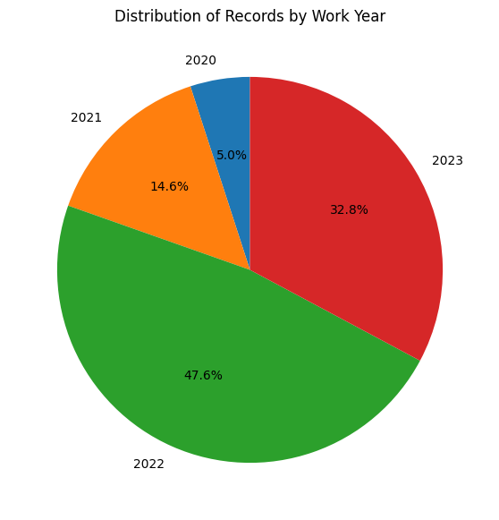


### Employment Type


```python
import pandas as pd

# Define custom order
order = ["FL", "CT", "PT", "FT"]

# Count occurrences of each employment_type
employment_type_counts = salaries_data_frame["employment_type"].value_counts()

# Reorder according to the custom order
employment_type_counts = employment_type_counts.reindex(order)

# Calculate percentages
employment_type_percent = (
    employment_type_counts / employment_type_counts.sum() * 100
).round(2)

# Calculate mean and median salary per employment_type
mean_salary = (
    salaries_data_frame.groupby("employment_type")["salary_in_usd"]
    .mean()
    .round(2)
    .reindex(order)
)
median_salary = (
    salaries_data_frame.groupby("employment_type")["salary_in_usd"]
    .median()
    .round(2)
    .reindex(order)
)

# Combine into one DataFrame
result = pd.DataFrame(
    {
        "count": employment_type_counts,
        "percentage": employment_type_percent,
        "mean_salary": mean_salary,
        "median_salary": median_salary,
    }
)

print(result)
```

                     count  percentage  mean_salary  median_salary
    employment_type
    FL                   6         0.4     45420.50        40261.5
    CT                   9         0.6    116052.11        60000.0
    PT                  12         0.8     38112.83        20371.0
    FT                1473        98.2    132134.13       130000.0


```python
# --- Pie Chart ---
import matplotlib.pyplot as plt

plt.figure(figsize=(7, 7))
plt.pie(
    employment_type_counts,
    labels=employment_type_counts.index,
    autopct="%1.1f%%",
    startangle=90,
    colors=["#66c2a5", "#fc8d62", "#8da0cb", "#e78ac3"],
)
plt.title("Distribution of Employment Types")
plt.show()
```


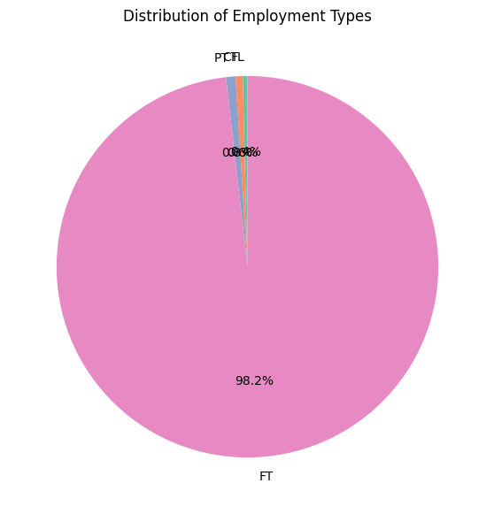


### Salary


```python
import matplotlib.pyplot as plt
import seaborn as sns


salary_in_usd_series = salaries_data_frame["salary_in_usd"]


# --- 1. Descriptive statistics ---
mean_salary = salary_in_usd_series.mean()
median_salary = salary_in_usd_series.median()
min_salary = salary_in_usd_series.min()
max_salary = salary_in_usd_series.max()


print(f"Salary ranges from ${min_salary:,.0f} to ${max_salary:,.0f}")
print(f"Mean salary: ${mean_salary:,.0f}")
print(f"Median salary: ${median_salary:,.0f}")


# Skew check
skewness = salary_in_usd_series.skew()
print(f"Skewness: {skewness:.2f}")
```

    Salary ranges from $5,409 to $450,000
    Mean salary: $130,934
    Median salary: $130,000
    Skewness: 0.59


```python
# --- 2. Histogram ---
plt.figure(figsize=(8, 5))
sns.histplot(salary_in_usd_series, bins=30, kde=True)
plt.axvline(
    mean_salary, color="red", linestyle="--", label=f"Mean = {mean_salary:,.0f}"
)
plt.axvline(
    median_salary, color="blue", linestyle="--", label=f"Median = {median_salary:,.0f}"
)
plt.title("Salary Distribution (USD)")
plt.xlabel("Salary")
plt.ylabel("Frequency")
plt.legend()
plt.show()
```


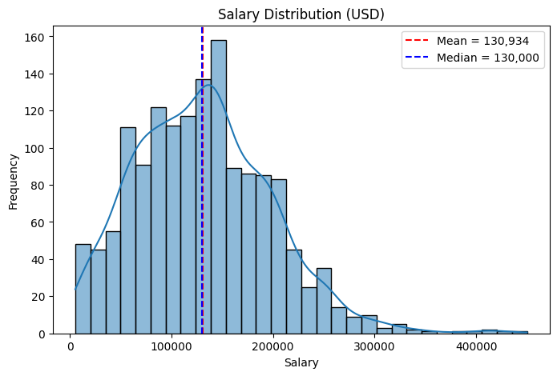


```python
# --- 3. Boxplot (to reveal outliers) ---
plt.figure(figsize=(6, 3))
sns.boxplot(x=salary_in_usd_series)
plt.title("Salary in USD - Boxplot")
plt.xlabel("Salary in USD")
plt.show()
```


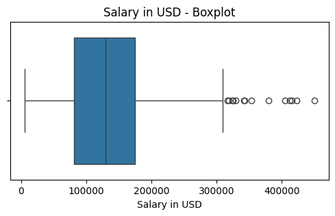


### Experience Level (with Salary)


```python
import pandas as pd
import matplotlib.pyplot as plt
import seaborn as sns

# ========================
# Preprocessing
# ========================
experience_level_order = ["EN", "MI", "SE", "EX"]
salaries_data_frame["experience_level"] = pd.Categorical(
    salaries_data_frame["experience_level"],
    categories=experience_level_order,
    ordered=True,
)

# ========================
# Counts and Percentages
# ========================
experience_level_counts = (
    salaries_data_frame["experience_level"].value_counts().sort_index()
)
experience_level_percent = (
    experience_level_counts / experience_level_counts.sum() * 100
).round(1)

result = pd.DataFrame(
    {"count": experience_level_counts, "percentage": experience_level_percent}
)

# ========================
# Mean and Median Salaries
# ========================
summary_table = (
    salaries_data_frame.groupby("experience_level")["salary_in_usd"]
    .agg(Mean="mean", Median="median")
    .round(0)
)

# ========================
# Combine Tables
# ========================
combined_table = result.join(summary_table)
print("Experience Level Summary:")
print(combined_table)
```

    Experience Level Summary:
                      count  percentage      Mean    Median
    experience_level
    EN                  167        11.1   69627.0   60000.0
    MI                  353        23.5   95473.0   84053.0
    SE                  922        61.5  151640.0  145000.0
    EX                   58         3.9  192463.0  188518.0


    /var/folders/jh/z981c7zj0vz0gmyfc8mhdxdr0000gn/T/ipykernel_6856/674642401.py:33: FutureWarning: The default of observed=False is deprecated and will be changed to True in a future version of pandas. Pass observed=False to retain current behavior or observed=True to adopt the future default and silence this warning.
      salaries_data_frame.groupby("experience_level")["salary_in_usd"]


```python
# ========================
# Pie Chart
# ========================
plt.figure(figsize=(7, 7))
plt.pie(
    experience_level_counts,
    labels=experience_level_counts.index,
    autopct="%1.1f%%",
    startangle=90,
    colors=["#66c2a5", "#fc8d62", "#8da0cb", "#e78ac3"],
)
plt.title("Distribution of Experience Levels")
plt.show()
```


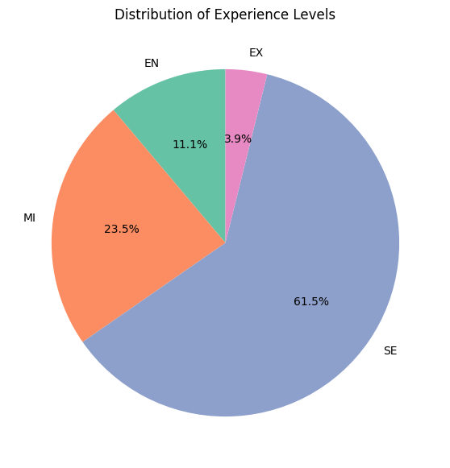


```python
# ========================
# Boxplot
# ========================
plt.figure(figsize=(8, 6))
sns.boxplot(
    data=salaries_data_frame,
    x="experience_level",
    y="salary_in_usd",
    order=experience_level_order,
    palette="Set2",
    hue="experience_level",
    legend=False,
)
plt.title("Salary Distribution by Experience Level", fontsize=14)
plt.ylabel("Salary (USD)")
plt.xlabel("Experience Level")
plt.tight_layout()
plt.show()
```


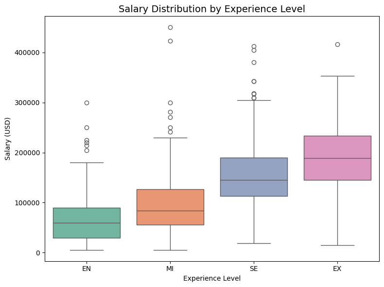


### Job Title (with Salary)


```python
import pandas as pd

# ========================
# Job title counts & percentages
# ========================
job_counts = salaries_data_frame["job_title"].value_counts()
total_jobs = job_counts.sum()

# DataFrame with count and percentage
all_job_titles = job_counts.to_frame("count").reset_index()
all_job_titles.columns = ["job_title", "count"]
all_job_titles["percentage"] = (all_job_titles["count"] / total_jobs * 100).round(2)

# Add accumulated count and percentage
all_job_titles["accumulated_count"] = all_job_titles["count"].cumsum()
all_job_titles["accumulated_percentage"] = (
    all_job_titles["accumulated_count"] / total_jobs * 100
).round(2)

# ========================
# Mean and median salary
# ========================
salary_summary = (
    salaries_data_frame.groupby("job_title")["salary_in_usd"]
    .agg(Mean="mean", Median="median")
    .round(0)
    .reset_index()
)

# ========================
# Combine tables
# ========================
all_job_titles = all_job_titles.merge(salary_summary, on="job_title", how="left")

# Print summary
print(f"Number of unique job titles: {len(all_job_titles)}")
print("\nAll job titles with accumulation, mean & median salary:")
print(all_job_titles.to_string(index=False, line_width=10000))
```

    Number of unique job titles: 69

    All job titles with accumulation, mean & median salary:
                                   job_title  count  percentage  accumulated_count  accumulated_percentage     Mean   Median
                               Data Engineer    366       24.40                366                   24.40 131523.0 130000.0
                              Data Scientist    360       24.00                726                   48.40 135659.0 141300.0
                                Data Analyst    210       14.00                936                   62.40 100195.0 100000.0
                   Machine Learning Engineer    106        7.07               1042                   69.47 145421.0 141942.0
                          Analytics Engineer     53        3.53               1095                   73.00 159451.0 152700.0
                              Data Architect     39        2.60               1134                   75.60 165886.0 167500.0
                           Applied Scientist     30        2.00               1164                   77.60 189030.0 184000.0
                        Data Science Manager     29        1.93               1193                   79.53 177154.0 175100.0
                          Research Scientist     27        1.80               1220                   81.33 127143.0 102772.0
                  Machine Learning Scientist     17        1.13               1237                   82.47 164900.0 180000.0
                           Research Engineer     14        0.93               1251                   83.40 184365.0 179500.0
                    Computer Vision Engineer     12        0.80               1263                   84.20 139076.0 147500.0
                                 ML Engineer     12        0.80               1275                   85.00 114463.0  80682.0
                      Data Analytics Manager     11        0.73               1286                   85.73 133176.0 140000.0
                             BI Data Analyst     10        0.67               1296                   86.40  56665.0  51900.0
                                AI Scientist     10        0.67               1306                   87.07  89447.0  50448.0
                    Director of Data Science     10        0.67               1316                   87.73 202086.0 180018.0
                       Business Data Analyst     10        0.67               1326                   88.40  80750.0  84566.0
          Applied Machine Learning Scientist      9        0.60               1335                   89.00 114501.0  75000.0
                           Big Data Engineer      9        0.60               1344                   89.60  51565.0  48289.0
                               ETL Developer      8        0.53               1352                   90.13 125192.0  93635.0
                                Data Manager      8        0.53               1360                   90.67 124000.0 117500.0
                    Principal Data Scientist      8        0.53               1368                   91.20 198171.0 164630.0
                      Applied Data Scientist      8        0.53               1376                   91.73 127158.0  89178.0
                                Head of Data      7        0.47               1383                   92.20 199780.0 230000.0
                     Data Science Consultant      7        0.47               1390                   92.67  69421.0  76833.0
                             Data Specialist      7        0.47               1397                   93.13 130000.0 130000.0
                    Data Operations Engineer      6        0.40               1403                   93.53  80000.0  80000.0
                                AI Developer      6        0.40               1409                   93.93 169670.0 154000.0
                          Lead Data Engineer      6        0.40               1415                   94.33 139230.0 120111.0
                         Lead Data Scientist      5        0.33               1420                   94.67  87416.0  61566.0
    Machine Learning Infrastructure Engineer      5        0.33               1425                   95.00 127133.0 148800.0
                  Machine Learning Developer      5        0.33               1430                   95.33  89726.0  76814.0
                        Data Quality Analyst      5        0.33               1435                   95.67  92000.0 100000.0
              Business Intelligence Engineer      4        0.27               1439                   95.93 174150.0 171150.0
           Computer Vision Software Engineer      4        0.27               1443                   96.20  83705.0  82873.0
                        Head of Data Science      4        0.27               1447                   96.47 146719.0 138938.0
                     Data Analytics Engineer      4        0.27               1451                   96.73  64799.0  64598.0
                           Lead Data Analyst      4        0.27               1455                   97.00  86152.0  77500.0
                        Product Data Analyst      3        0.20               1458                   97.20  55357.0  20000.0
                       Data Science Engineer      3        0.20               1461                   97.40  75803.0  60000.0
                     Principal Data Engineer      2        0.13               1463                   97.53 192500.0 192500.0
              Lead Machine Learning Engineer      2        0.13               1465                   97.67  89720.0  89720.0
                         Cloud Data Engineer      2        0.13               1467                   97.80 124647.0 124647.0
                      Principal Data Analyst      2        0.13               1469                   97.93 122500.0 122500.0
                                ETL Engineer      2        0.13               1471                   98.07  71394.0  71394.0
                     Data Operations Analyst      2        0.13               1473                   98.20  73500.0  73500.0
                      Financial Data Analyst      2        0.13               1475                   98.33  87500.0  87500.0
                                Data Modeler      2        0.13               1477                   98.47 118900.0 118900.0
          Machine Learning Research Engineer      2        0.13               1479                   98.60  16086.0  16086.0
                             Data Strategist      2        0.13               1481                   98.73  81000.0  81000.0
                              MLOps Engineer      2        0.13               1483                   98.87 129000.0 129000.0
                        Data DevOps Engineer      1        0.07               1484                   98.93  53654.0  53654.0
                            BI Data Engineer      1        0.07               1485                   99.00  60000.0  60000.0
                        Staff Data Scientist      1        0.07               1486                   99.07 105000.0 105000.0
                          Big Data Architect      1        0.07               1487                   99.13  99703.0  99703.0
                          Staff Data Analyst      1        0.07               1488                   99.20  15000.0  15000.0
                      Marketing Data Analyst      1        0.07               1489                   99.27  88654.0  88654.0
               3D Computer Vision Researcher      1        0.07               1490                   99.33   5409.0   5409.0
                 Machine Learning Researcher      1        0.07               1491                   99.40  50000.0  50000.0
                    Machine Learning Manager      1        0.07               1492                   99.47 117104.0 117104.0
           Applied Machine Learning Engineer      1        0.07               1493                   99.53  69751.0  69751.0
                         Data Analytics Lead      1        0.07               1494                   99.60 405000.0 405000.0
                     Compliance Data Analyst      1        0.07               1495                   99.67  30000.0  30000.0
                   Data Analytics Consultant      1        0.07               1496                   99.73 113000.0 113000.0
                    Head of Machine Learning      1        0.07               1497                   99.80  76309.0  76309.0
                                NLP Engineer      1        0.07               1498                   99.87  60000.0  60000.0
                        Cloud Data Architect      1        0.07               1499                   99.93 250000.0 250000.0
                        Finance Data Analyst      1        0.07               1500                  100.00  61896.0  61896.0


```python
import matplotlib.pyplot as plt
import pandas as pd

# Count all job titles and calculate percentages
job_counts = salaries_data_frame["job_title"].value_counts()
total_jobs = job_counts.sum()

# Keep top 10 job titles and group the rest as 'Other'
top_n = 10
top_jobs = job_counts.head(top_n)
other_count = total_jobs - top_jobs.sum()

# Use pd.concat to combine top jobs and 'Other'
job_counts_for_pie = pd.concat([top_jobs, pd.Series({"Other": other_count})])

# Pie Chart
plt.figure(figsize=(8, 8))
plt.pie(
    job_counts_for_pie,
    labels=job_counts_for_pie.index,
    autopct="%1.1f%%",
    startangle=90,
    colors=plt.cm.tab20.colors  # color map for slices
)
plt.title(f"Top {top_n} Job Titles Distribution")
plt.show()

```


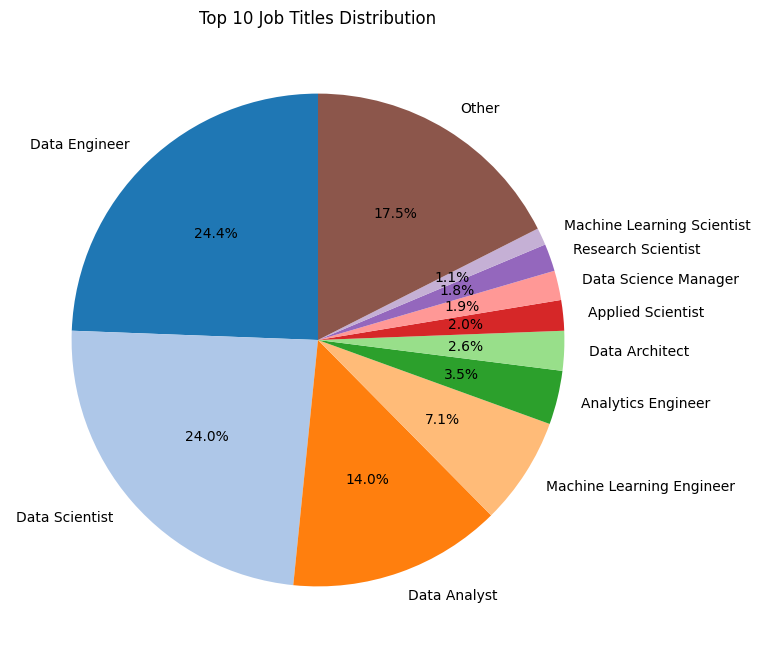


### Company Location


```python
import pandas as pd
import matplotlib.pyplot as plt

# ========================
# Count company locations
# ========================
location_counts = salaries_data_frame["company_location"].value_counts()
total_locations = location_counts.sum()

# Create DataFrame with count and percentage
all_locations = location_counts.to_frame("count").reset_index()
all_locations.columns = ["company_location", "count"]
all_locations["percentage"] = (all_locations["count"] / total_locations * 100).round(2)

# Add accumulated count and percentage
all_locations["accumulated_count"] = all_locations["count"].cumsum()
all_locations["accumulated_percentage"] = (
    all_locations["accumulated_count"] / total_locations * 100
).round(2)

# ========================
# Mean and Median Salaries
# ========================
salary_summary = (
    salaries_data_frame.groupby("company_location")["salary_in_usd"]
    .agg(Mean="mean", Median="median")
    .round(0)
    .reset_index()
)

# Merge with main table
all_locations = all_locations.merge(salary_summary, on="company_location", how="left")

# ========================
# Print summary
# ========================
print(f"Number of unique company locations: {len(all_locations)}")
```

    Number of unique company locations: 58


```python
pd.set_option("display.max_rows", None)  # Show all rows in output
print("\nAll company locations with salary stats:")
print(all_locations.to_string(index=False, line_width=10000))
```


    All company locations with salary stats:
    company_location  count  percentage  accumulated_count  accumulated_percentage     Mean   Median
                  US   1101       73.40               1101                   73.40 152070.0 145000.0
                  GB     91        6.07               1192                   79.47  83555.0  80036.0
                  CA     50        3.33               1242                   82.80 117373.0  97908.0
                  IN     37        2.47               1279                   85.27  33720.0  20670.0
                  DE     35        2.33               1314                   87.60  86249.0  76833.0
                  ES     29        1.93               1343                   89.53  50044.0  47282.0
                  FR     20        1.33               1363                   90.87  61112.0  55196.0
                  GR     13        0.87               1376                   91.73  54786.0  52533.0
                  NL     11        0.73               1387                   92.47  71873.0  69741.0
                  JP      6        0.40               1393                   92.87 114127.0  75682.0
                  PT      6        0.40               1399                   93.27  40065.0  40062.0
                  BR      5        0.33               1404                   93.60  13975.0  12901.0
                  AT      5        0.33               1409                   93.93  67765.0  61989.0
                  AU      5        0.33               1414                   94.27 100834.0  83864.0
                  PL      4        0.27               1418                   94.53  65587.0  40103.0
                  BE      4        0.27               1422                   94.80  76865.0  83398.0
                  DK      4        0.27               1426                   95.07  45558.0  37252.0
                  TR      4        0.27               1430                   95.33  21322.0  22586.0
                  PR      4        0.27               1434                   95.60 167500.0 167500.0
                  NG      4        0.27               1438                   95.87  47500.0  40000.0
                  UA      4        0.27               1442                   96.13  57850.0  55000.0
                  IE      3        0.20               1445                   96.33 117764.0 113750.0
                  PK      3        0.20               1448                   96.53  13333.0  12000.0
                  FI      3        0.20               1451                   96.73  68793.0  68318.0
                  LU      3        0.20               1454                   96.93  43943.0  59102.0
                  AE      3        0.20               1457                   97.13 100000.0 115000.0
                  CH      3        0.20               1460                   97.33  60940.0  56536.0
                  IT      2        0.13               1462                   97.47  36366.0  36366.0
                  RU      2        0.13               1464                   97.60 157500.0 157500.0
                  SI      2        0.13               1466                   97.73  63831.0  63831.0
                  MX      2        0.13               1468                   97.87  46756.0  46756.0
                  CF      2        0.13               1470                   98.00  48609.0  48609.0
                  CZ      2        0.13               1472                   98.13  50234.0  50234.0
                  SG      2        0.13               1474                   98.27  77276.0  77276.0
                  ID      2        0.13               1476                   98.40  34208.0  34208.0
                  AS      2        0.13               1478                   98.53  34026.0  34026.0
                  CO      1        0.07               1479                   98.60  21844.0  21844.0
                  HU      1        0.07               1480                   98.67  35735.0  35735.0
                  KE      1        0.07               1481                   98.73   9272.0   9272.0
                  TH      1        0.07               1482                   98.80  15000.0  15000.0
                  NZ      1        0.07               1483                   98.87 125000.0 125000.0
                  CL      1        0.07               1484                   98.93  40038.0  40038.0
                  MD      1        0.07               1485                   99.00  18000.0  18000.0
                  HR      1        0.07               1486                   99.07  45618.0  45618.0
                  IL      1        0.07               1487                   99.13 119059.0 119059.0
                  CN      1        0.07               1488                   99.20 100000.0 100000.0
                  EE      1        0.07               1489                   99.27  31520.0  31520.0
                  IQ      1        0.07               1490                   99.33 100000.0 100000.0
                  RO      1        0.07               1491                   99.40  60000.0  60000.0
                  DZ      1        0.07               1492                   99.47 100000.0 100000.0
                  HN      1        0.07               1493                   99.53  20000.0  20000.0
                  HK      1        0.07               1494                   99.60  65062.0  65062.0
                  MY      1        0.07               1495                   99.67  40000.0  40000.0
                  EG      1        0.07               1496                   99.73  22800.0  22800.0
                  AR      1        0.07               1497                   99.80  50000.0  50000.0
                  PH      1        0.07               1498                   99.87  50000.0  50000.0
                  BO      1        0.07               1499                   99.93   7500.0   7500.0
                  MT      1        0.07               1500                  100.00  28369.0  28369.0


```python
# ========================
# Pie Chart
# ========================
plt.figure(figsize=(8, 8))
plt.pie(
    all_locations["count"],
    labels=all_locations["company_location"],  # now from column
    autopct="%1.1f%%",
    startangle=90,
    counterclock=False,
)
plt.title("Company Location Distribution", fontsize=14)
plt.show()
```


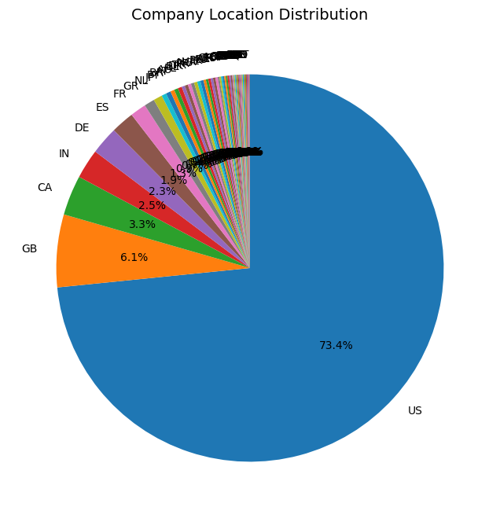


### Employee Residence


```python
import pandas as pd
import matplotlib.pyplot as plt

# ========================
# Count company locations
# ========================
location_counts = salaries_data_frame["employee_residence"].value_counts()
total_locations = location_counts.sum()

# Create DataFrame with count and percentage
all_locations = location_counts.to_frame("count").reset_index()
all_locations.columns = ["employee_residence", "count"]
all_locations["percentage"] = (all_locations["count"] / total_locations * 100).round(2)

# Add accumulated count and percentage
all_locations["accumulated_count"] = all_locations["count"].cumsum()
all_locations["accumulated_percentage"] = (
    all_locations["accumulated_count"] / total_locations * 100
).round(2)

# ========================
# Mean and Median Salaries
# ========================
salary_summary = (
    salaries_data_frame.groupby("employee_residence")["salary_in_usd"]
    .agg(Mean="mean", Median="median")
    .round(0)
    .reset_index()
)

# Merge with main table
all_locations = all_locations.merge(salary_summary, on="employee_residence", how="left")

# ========================
# Print summary
# ========================
print(f"Number of unique company locations: {len(all_locations)}")

```

    Number of unique company locations: 61


```python
pd.set_option("display.max_rows", None)  # Show all rows in output
print("\nAll company locations with salary stats:")
print(all_locations.to_string(index=False, line_width=10000))
```


    All company locations with salary stats:
    employee_residence  count  percentage  accumulated_count  accumulated_percentage     Mean   Median
                    US   1074       71.60               1074                   71.60 153964.0 145000.0
                    GB     86        5.73               1160                   77.33  83552.0  80036.0
                    CA     48        3.20               1208                   80.53 118217.0  99852.0
                    IN     46        3.07               1254                   83.60  41481.0  22124.0
                    ES     31        2.07               1285                   85.67  58777.0  48289.0
                    DE     30        2.00               1315                   87.67  91712.0  78015.0
                    FR     24        1.60               1339                   89.27  54593.0  55196.0
                    GR     15        1.00               1354                   90.27  57953.0  52533.0
                    NL     12        0.80               1366                   91.07  72966.0  71644.0
                    PT     10        0.67               1376                   91.73  48791.0  40850.0
                    BR      8        0.53               1384                   92.27  42735.0  15904.0
                    JP      7        0.47               1391                   92.73 103538.0  74000.0
                    PK      6        0.40               1397                   93.13  27036.0  16000.0
                    AU      6        0.40               1403                   93.53  95414.0  83518.0
                    NG      5        0.33               1408                   93.87  41000.0  30000.0
                    PR      5        0.33               1413                   94.20 166000.0 160000.0
                    PL      4        0.27               1417                   94.47  55682.0  40103.0
                    IT      4        0.27               1421                   94.73  61600.0  36366.0
                    TR      4        0.27               1425                   95.00  21322.0  22586.0
                    AT      4        0.27               1429                   95.27  69339.0  68060.0
                    BE      4        0.27               1433                   95.53  76865.0  83398.0
                    RU      4        0.27               1437                   95.80 105750.0  72500.0
                    UA      4        0.27               1441                   96.07  57850.0  55000.0
                    BO      3        0.20               1444                   96.27  52500.0  75000.0
                    DK      3        0.20               1447                   96.47  31193.0  28609.0
                    AR      3        0.20               1450                   96.67  52667.0  50000.0
                    IE      3        0.20               1453                   96.87 117764.0 113750.0
                    SG      3        0.20               1456                   97.07  91203.0  89294.0
                    AE      3        0.20               1459                   97.27 100000.0 115000.0
                    SI      2        0.13               1461                   97.40  63831.0  63831.0
                    CH      2        0.13               1463                   97.53  88469.0  88469.0
                    CF      2        0.13               1465                   97.67  48609.0  48609.0
                    RO      2        0.13               1467                   97.80  51419.0  51419.0
                    HK      2        0.13               1469                   97.93  65542.0  65542.0
                    VN      2        0.13               1471                   98.07  44200.0  44200.0
                    FI      2        0.13               1473                   98.20  69030.0  69030.0
                    PH      2        0.13               1475                   98.33  47880.0  47880.0
                    HU      2        0.13               1477                   98.47  35997.0  35997.0
                    RS      1        0.07               1478                   98.53  25532.0  25532.0
                    JE      1        0.07               1479                   98.60 100000.0 100000.0
                    KE      1        0.07               1480                   98.67   9272.0   9272.0
                    LU      1        0.07               1481                   98.73  59102.0  59102.0
                    CO      1        0.07               1482                   98.80  21844.0  21844.0
                    NZ      1        0.07               1483                   98.87 125000.0 125000.0
                    CL      1        0.07               1484                   98.93  40038.0  40038.0
                    MD      1        0.07               1485                   99.00  18000.0  18000.0
                    HR      1        0.07               1486                   99.07  45618.0  45618.0
                    MX      1        0.07               1487                   99.13  33511.0  33511.0
                    EG      1        0.07               1488                   99.20  22800.0  22800.0
                    BG      1        0.07               1489                   99.27  80000.0  80000.0
                    IQ      1        0.07               1490                   99.33 100000.0 100000.0
                    DZ      1        0.07               1491                   99.40 100000.0 100000.0
                    CZ      1        0.07               1492                   99.47  69999.0  69999.0
                    TN      1        0.07               1493                   99.53  30469.0  30469.0
                    HN      1        0.07               1494                   99.60  20000.0  20000.0
                    EE      1        0.07               1495                   99.67  31520.0  31520.0
                    MY      1        0.07               1496                   99.73 200000.0 200000.0
                    ID      1        0.07               1497                   99.80  15000.0  15000.0
                    DO      1        0.07               1498                   99.87 110000.0 110000.0
                    TH      1        0.07               1499                   99.93  15000.0  15000.0
                    MT      1        0.07               1500                  100.00  28369.0  28369.0


```python
# ========================
# Pie Chart
# ========================
plt.figure(figsize=(8, 8))
plt.pie(
    all_locations["count"],
    labels=all_locations["employee_residence"],  # now from column
    autopct="%1.1f%%",
    startangle=90,
    counterclock=False,
)
plt.title("Company Location Distribution", fontsize=14)
plt.show()
```


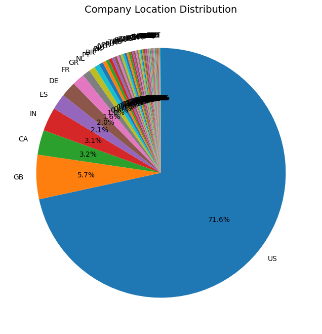


#### Remote Ratio (with Salary)


```python
import pandas as pd
import matplotlib.pyplot as plt

# ========================
# Define custom order
# ========================
order = [0, 50, 100]

# Count occurrences of each remote_ratio
remote_ratio_counts = salaries_data_frame["remote_ratio"].value_counts()

# Reorder according to the custom order
remote_ratio_counts = remote_ratio_counts.reindex(order)

# Calculate percentages
remote_ratio_percent = (remote_ratio_counts / remote_ratio_counts.sum() * 100).round(2)

# ========================
# Mean and Median Salaries
# ========================
salary_summary = (
    salaries_data_frame.groupby("remote_ratio")["salary_in_usd"]
    .agg(Mean="mean", Median="median")
    .round(0)
    .reindex(order)
)

# ========================
# Combine into one DataFrame
# ========================
result = pd.DataFrame(
    {
        "count": remote_ratio_counts,
        "percentage": remote_ratio_percent,
        "Mean": salary_summary["Mean"],
        "Median": salary_summary["Median"],
    }
)

print("Remote Work Ratio Summary:")
print(result)
```

    Remote Work Ratio Summary:
                  count  percentage      Mean    Median
    remote_ratio
    0               579       38.60  143867.0  139430.0
    50              130        8.67   81360.0   65135.0
    100             791       52.73  129658.0  131050.0


```python
# ========================
# Draw Pie Chart
# ========================
plt.figure(figsize=(6, 6))
plt.pie(
    result["count"],
    labels=result.index.astype(str) + " % remote",
    autopct="%1.1f%%",
    startangle=90,
    counterclock=False,
)
plt.title("Remote Work Ratio Distribution", fontsize=14)
plt.show()
```


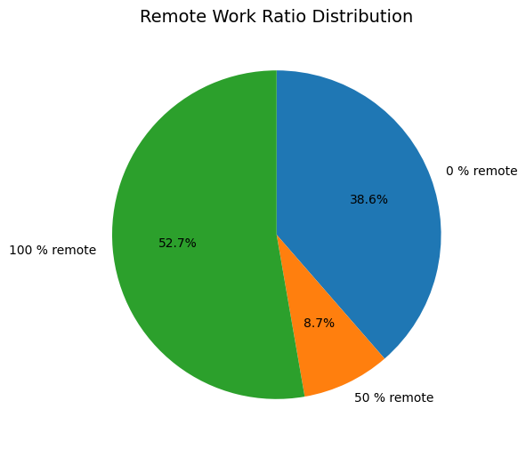


#### Company Size (with Salary)


```python
import pandas as pd
import matplotlib.pyplot as plt

# ========================
# Define custom order
# ========================
order = ["S", "M", "L"]

# Count occurrences of each company_size
company_size_counts = salaries_data_frame["company_size"].value_counts()

# Reorder according to the custom order
company_size_counts = company_size_counts.reindex(order)

# Calculate percentages
company_size_percent = (company_size_counts / company_size_counts.sum() * 100).round(2)

# ========================
# Mean and Median Salaries
# ========================
salary_summary = (
    salaries_data_frame.groupby("company_size")["salary_in_usd"]
    .agg(Mean="mean", Median="median")
    .round(0)
    .reindex(order)
)

# ========================
# Combine into one DataFrame
# ========================
result = pd.DataFrame(
    {
        "count": company_size_counts,
        "percentage": company_size_percent,
        "Mean": salary_summary["Mean"],
        "Median": salary_summary["Median"],
    }
)

print("Company Size Summary:")
print(result)
```

    Company Size Summary:
                  count  percentage      Mean    Median
    company_size
    S               107        7.13   77723.0   61566.0
    M              1073       71.53  139114.0  137270.0
    L               320       21.33  121396.0  112300.0


```python
# ========================
# Pie chart visualization
# ========================
plt.figure(figsize=(6, 6))
plt.pie(
    company_size_counts,
    labels=order,
    autopct="%1.1f%%",
    startangle=90,
    counterclock=False,
)
plt.title("Distribution of Company Size")
plt.show()
```


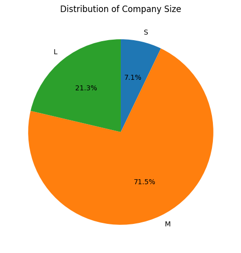


## Data Preparation and Model Training

### Handling Data Issues

#### Missing Values Issues


```python
# Drop rows with any missing values
salaries_data_frame = salaries_data_frame.dropna()
salaries_data_frame.shape
```


    (1494, 11)


#### Employment Type Filter


```python
# Keep only full-time employees
salaries_data_frame = salaries_data_frame[salaries_data_frame["employment_type"] == "FT"]  # assuming "FT" is the code for full-time
salaries_data_frame.shape
```


    (1467, 11)


#### Job Titles Filter


```python
# ===== FILTER OUT JOB TITLES WITH FEWER THAN 100 RECORDS =====
threshold = 100
job_counts = salaries_data_frame["job_title"].value_counts()
salaries_data_frame = salaries_data_frame[salaries_data_frame["job_title"].isin(job_counts[job_counts >= threshold].index)]
salaries_data_frame.shape
```


    (1030, 11)


### Salary Distribution after Filter


```python
import pandas as pd
import matplotlib.pyplot as plt
import seaborn as sns

# --- 1. Descriptive statistics ---
salary_in_usd_series = salaries_data_frame["salary_in_usd"]

mean_salary = salary_in_usd_series.mean()
median_salary = salary_in_usd_series.median()
min_salary = salary_in_usd_series.min()
max_salary = salary_in_usd_series.max()

print(f"Salary ranges from ${min_salary:,.0f} to ${max_salary:,.0f}")
print(f"Mean salary: ${mean_salary:,.0f}")
print(f"Median salary: ${median_salary:,.0f}")

# Skew check
skewness = salary_in_usd_series.skew()
print(f"Skewness: {skewness:.2f}")
```

    Salary ranges from $5,679 to $412,000
    Mean salary: $128,589
    Median salary: $129,300
    Skewness: 0.43


```python
# --- 2. Histogram ---
plt.figure(figsize=(8, 5))
sns.histplot(salary_in_usd_series, bins=30, kde=True)
plt.axvline(
    mean_salary, color="red", linestyle="--", label=f"Mean = {mean_salary:,.0f}"
)
plt.axvline(
    median_salary, color="blue", linestyle="--", label=f"Median = {median_salary:,.0f}"
)
plt.title("Salary Distribution (USD)")
plt.xlabel("Salary")
plt.ylabel("Frequency")
plt.legend()
plt.show()
```


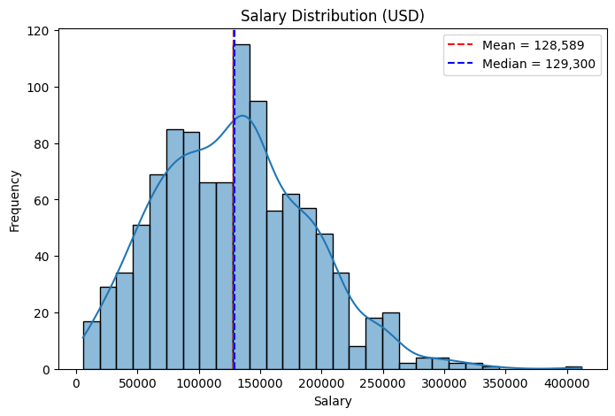


```python
# --- 3. Boxplot (to reveal outliers) ---
plt.figure(figsize=(6, 3))
sns.boxplot(x=salary_in_usd_series)
plt.title("Salary in USD - Boxplot")
plt.xlabel("Salary in USD")
plt.show()
```


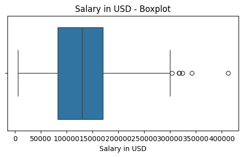


```python
# --- 4. Identify outliers using IQR rule ---
Q1 = salary_in_usd_series.quantile(0.25)
Q3 = salary_in_usd_series.quantile(0.75)
IQR = Q3 - Q1

lower_bound = Q1 - 1.5 * IQR
upper_bound = Q3 + 1.5 * IQR

outliers = salaries_data_frame[
    (salaries_data_frame["salary_in_usd"] < lower_bound)
    | (salaries_data_frame["salary_in_usd"] > upper_bound)
]

print(f"\nNumber of outliers: {len(outliers)}")
print("Outlier rows:")
print(outliers.sort_values("salary_in_usd").to_string(index=False, line_width=10000))
```


    Number of outliers: 6
    Outlier rows:
     work_year experience_level employment_type                 job_title   salary salary_currency  salary_in_usd employee_residence  remote_ratio company_location company_size
          2023               SE              FT Machine Learning Engineer 304000.0             USD       304000.0                 US           100               US            M
          2023               SE              FT            Data Scientist 317070.0             USD       317070.0                 US             0               US            M
          2023               SE              FT Machine Learning Engineer 318300.0             USD       318300.0                 US           100               US            M
          2022               EX              FT             Data Engineer 324000.0             USD       324000.0                 US           100               US            M
          2023               SE              FT Machine Learning Engineer 342300.0             USD       342300.0                 US             0               US            L
          2020               SE              FT            Data Scientist 412000.0             USD       412000.0                 US           100               US            L


```python
# --- 5. Remove outliers ---
print(f"\nData shape before removing outliers: {salaries_data_frame.shape}")

salaries_data_frame = salaries_data_frame[
    (salaries_data_frame["salary_in_usd"] >= lower_bound)
    & (salaries_data_frame["salary_in_usd"] <= upper_bound)
].copy()

print(f"Data shape after removing outliers: {salaries_data_frame.shape}")
```


    Data shape before removing outliers: (1030, 11)
    Data shape after removing outliers: (1024, 11)


### Model Training and Performance (Supervised Learning)

#### First Try


```python
# ========================
# 1. Import libraries
# ========================
from sklearn.model_selection import train_test_split
from sklearn.compose import ColumnTransformer
import matplotlib.pyplot as plt
import seaborn as sns
from xgboost import XGBRegressor
from lightgbm import LGBMRegressor
from catboost import CatBoostRegressor
from sklearn.linear_model import LinearRegression
from sklearn.ensemble import RandomForestRegressor, GradientBoostingRegressor
from sklearn.metrics import root_mean_squared_error, r2_score, mean_absolute_error
from sklearn.preprocessing import StandardScaler, OneHotEncoder


print(salaries_data_frame.shape)

# ========================
# 2. Define features & target
# ========================
categorical_cols_1 = [
    "experience_level",
    "job_title",
    "employee_residence",
    "company_location",
    "company_size",
]
numeric_cols_1 = ["work_year", "remote_ratio"]
features = categorical_cols_1 + numeric_cols_1

X_1 = salaries_data_frame[features]
X_1.shape

y_1 = salaries_data_frame["salary_in_usd"]
y_1.shape

# ========================
# 3. Split dataset
# ========================
X_train_1, X_test_1, y_train_1, y_test_1 = train_test_split(
    X_1, y_1, test_size=0.2, random_state=42
)

# ========================
# 4. Preprocess features
# ========================
preprocessor_1 = ColumnTransformer(
    transformers=[
        ("cat", OneHotEncoder(handle_unknown="ignore"), categorical_cols_1),
        ("num", StandardScaler(), numeric_cols_1),
    ]
)

X_train_processed_1 = preprocessor_1.fit_transform(X_train_1)
X_test_processed_1 = preprocessor_1.transform(X_test_1)

# ========================
# 5. Define models_1
# ========================
models_1 = {
    "LinearRegression": LinearRegression(),
    "RandomForest": RandomForestRegressor(
        n_estimators=500,
        max_depth=10,
        min_samples_leaf=2,
        max_features="sqrt",
        random_state=42,
        n_jobs=-1,
    ),
    "GradientBoosting": GradientBoostingRegressor(
        n_estimators=500, learning_rate=0.05, max_depth=5, random_state=42
    ),
    "XGBoost": XGBRegressor(
        n_estimators=500,
        learning_rate=0.05,
        max_depth=6,
        subsample=0.8,
        colsample_bytree=0.8,
        random_state=42,
    ),
    "LightGBM": LGBMRegressor(
        n_estimators=500,
        learning_rate=0.05,
        max_depth=-1,
        num_leaves=31,
        subsample=0.8,
        colsample_bytree=0.8,
        random_state=42,
        verbose=-1,
    ),
    "CatBoost": CatBoostRegressor(
        iterations=500, learning_rate=0.05, depth=6, random_state=42, verbose=0
    ),
}
# ========================
# 6. Train & evaluate
# ========================
results_1 = {}
true_avg_salary_1 = y_test_1.mean()  # True average salary

for name, model in models_1.items():
    model.fit(X_train_processed_1, y_train_1)
    y_pred_1 = model.predict(X_test_processed_1)

    r2_1 = r2_score(y_test_1, y_pred_1)
    mae_1 = mean_absolute_error(y_test_1, y_pred_1)
    rmse_1 = root_mean_squared_error(y_test_1, y_pred_1)
    pred_avg_salary_1 = y_pred_1.mean()  # Predicted average salary

    results_1[name] = {
        "R²": r2_1,
        "MAE": mae_1,
        "RMSE": rmse_1,
        "Predicted Avg Salary": pred_avg_salary_1,
        "True Avg Salary": true_avg_salary_1,
        "MAE % of Avg": (mae_1 / true_avg_salary_1) * 100,
        "RMSE % of Avg": (rmse_1 / true_avg_salary_1) * 100,
    }

# Convert to DataFrame for easy comparison
results_1_df = pd.DataFrame(results_1).T
results_1_df = results_1_df.sort_values(by="R²", ascending=False)

print(results_1_df.to_string(line_width=10000))
print("\nBest model based on R² (first try):", results_1_df.index[0])
```

    (1024, 11)
                            R²           MAE          RMSE  Predicted Avg Salary  True Avg Salary  MAE % of Avg  RMSE % of Avg
    LinearRegression  0.629053  27303.373122  35368.517685         120906.412330    123309.063415     22.142227      28.682821
    CatBoost          0.616604  28005.258412  35957.105376         122872.555382    123309.063415     22.711436      29.160148
    RandomForest      0.606062  29080.926635  36448.131228         124015.973678    123309.063415     23.583771      29.558355
    LightGBM          0.592627  29326.523212  37064.429899         122512.490878    123309.063415     23.782942      30.058155
    GradientBoosting  0.588988  28621.231316  37229.615673         123475.372894    123309.063415     23.210971      30.192116
    XGBoost           0.568748  29118.501412  38135.275702         123119.304688    123309.063415     23.614243      30.926580

    Best model based on R² (first try): LinearRegression


    /opt/homebrew/lib/python3.13/site-packages/sklearn/utils/validation.py:2739: UserWarning: X does not have valid feature names, but LGBMRegressor was fitted with feature names
      warnings.warn(


#### Linear Regression


```python
import matplotlib.pyplot as plt

# Fit Linear Regression only
lin_model = LinearRegression()
lin_model.fit(X_train_processed_1, y_train_1)

# Predictions
y_pred_lin_1 = lin_model.predict(X_test_processed_1)

# Evaluation
rmse = root_mean_squared_error(y_test_1, y_pred_lin_1)
r2 = r2_score(y_test_1, y_pred_lin_1)

print(f"Linear Regression → RMSE: {rmse:.2f}, R²: {r2:.3f}")

# ======== Plot Predicted vs Actual ========
plt.figure(figsize=(6,6))
plt.scatter(y_test_1, y_pred_lin_1, alpha=0.5, edgecolor="k")
plt.plot(
    [y_test_1.min(), y_test_1.max()],
    [y_test_1.min(), y_test_1.max()],
    color="red",
    linewidth=2,
    label="Perfect Prediction",
)

plt.xlabel("Actual Salary (USD)")
plt.ylabel("Predicted Salary (USD)")
plt.title(f"Linear Regression: Predicted vs Actual (R² = {r2:.3f})")
plt.legend()
plt.tight_layout()
plt.show()
```

    Linear Regression → RMSE: 35368.52, R²: 0.629


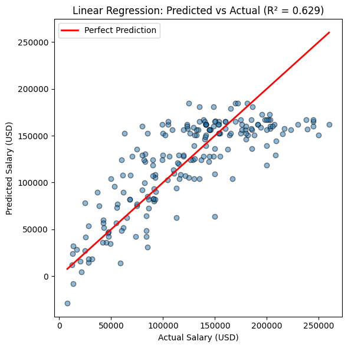


#### Features Importance


```python
# ========================
# 7. Aggregate feature importances by original feature (LinearRegression)
# ========================

# Get coefficients from LinearRegression
linreg_coefs_1 = models_1["LinearRegression"].coef_

# Use same OHE feature names as before
ohe_1 = preprocessor_1.named_transformers_["cat"]
ohe_features_1 = ohe_1.get_feature_names_out(categorical_cols_1)
all_features_1 = list(ohe_features_1) + numeric_cols_1


# Map back to original columns
def map_to_original(feature_name_1):
    for col_1 in categorical_cols_1:
        if feature_name_1.startswith(col_1 + "_"):
            return col_1
    if feature_name_1 in numeric_cols_1:
        return feature_name_1
    return feature_name_1


original_features = [map_to_original(f) for f in all_features_1]

# Aggregate absolute coefficients as importance
feature_importance_salaries_data_frame_1 = (
    pd.DataFrame({"feature": original_features, "importance": abs(linreg_coefs_1)})
    .groupby("feature")
    .sum()
    .sort_values(by="importance", ascending=False)
    .reset_index()
)

print("\n=== Aggregated Feature Importances (LinearRegression coefficients) ===")
print(feature_importance_salaries_data_frame_1)
```


    === Aggregated Feature Importances (LinearRegression coefficients) ===
                  feature     importance
    0  employee_residence  861523.318181
    1    company_location  821887.349490
    2    experience_level  113766.160440
    3           job_title   65834.525101
    4        company_size   18510.995165
    5           work_year    4035.817322
    6        remote_ratio     871.710623


```python
# ========================
# 8. Visualize aggregated feature importances
# ========================
plt.figure(figsize=(8, 5))
sns.barplot(x="importance", y="feature", data=feature_importance_salaries_data_frame_1)
plt.title("Aggregated Feature Importances (LinearRegression Coefficients)")
plt.xlabel("Importance (absolute coefficient)")
plt.ylabel("Feature")
plt.tight_layout()
plt.show()
```


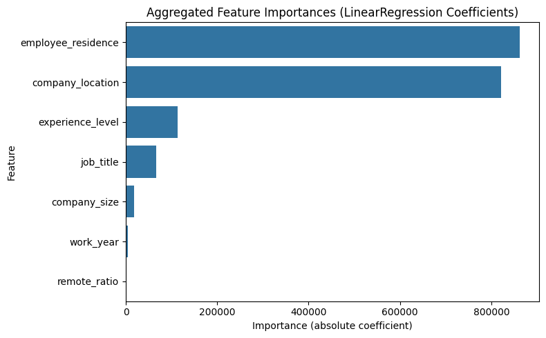


### Second Training (Removing Work Year, Company Size and Remote Ratio)


```python
# ========================
# 1. Import libraries
# ========================
from sklearn.model_selection import train_test_split
from sklearn.compose import ColumnTransformer
from xgboost import XGBRegressor
from lightgbm import LGBMRegressor
from catboost import CatBoostRegressor
from sklearn.linear_model import LinearRegression
from sklearn.ensemble import RandomForestRegressor, GradientBoostingRegressor
from sklearn.metrics import root_mean_squared_error, r2_score, mean_absolute_error
from sklearn.preprocessing import OneHotEncoder


print(salaries_data_frame.shape)

# ========================
# 2. Define features & target
# ========================
features_2 = ["experience_level", "job_title", "employee_residence", "company_location"]

X = salaries_data_frame[features_2]
X.shape

y = salaries_data_frame["salary_in_usd"]
y.shape

# ========================
# 3. Split dataset
# ========================
X_train_2, X_test_2, y_train_2, y_test_2 = train_test_split(
    X, y, test_size=0.2, random_state=42
)

# ========================
# 4. Preprocess features
# ========================
preprocessor_2 = ColumnTransformer(
    transformers=[("cat", OneHotEncoder(handle_unknown="ignore"), features_2)]
)

X_train_processed_2 = preprocessor_2.fit_transform(X_train_2)
X_test_processed_2 = preprocessor_2.transform(X_test_2)

# ========================
# 5. Define models_2
# ========================
models_2 = {
    "LinearRegression": LinearRegression(),
    "RandomForest": RandomForestRegressor(
        n_estimators=500,
        max_depth=10,
        min_samples_leaf=2,
        max_features="sqrt",
        random_state=42,
        n_jobs=-1,
    ),
    "GradientBoosting": GradientBoostingRegressor(
        n_estimators=500, learning_rate=0.05, max_depth=5, random_state=42
    ),
    "XGBoost": XGBRegressor(
        n_estimators=500,
        learning_rate=0.05,
        max_depth=6,
        subsample=0.8,
        colsample_bytree=0.8,
        random_state=42,
    ),
    "LightGBM": LGBMRegressor(
        n_estimators=500,
        learning_rate=0.05,
        max_depth=-1,
        num_leaves=31,
        subsample=0.8,
        colsample_bytree=0.8,
        random_state=42,
        verbose=-1,
    ),
    "CatBoost": CatBoostRegressor(
        iterations=500, learning_rate=0.05, depth=6, random_state=42, verbose=0
    ),
}

# ========================
# 6. Train & evaluate
# ========================
results_2 = {}
true_avg_salary = y_test_2.mean()  # True average salary

for name, model in models_2.items():
    model.fit(X_train_processed_2, y_train_2)
    y_pred_2 = model.predict(X_test_processed_2)

    rmse_2 = root_mean_squared_error(y_test_2, y_pred_2)
    mae_2 = mean_absolute_error(y_test_2, y_pred_2)
    r2_2 = r2_score(y_test_2, y_pred_2)
    pred_avg_salary_2 = y_pred_2.mean()  # Predicted average salary

    results_2[name] = {
        "R²": r2_2,
        "MAE": mae_2,
        "RMSE": rmse_2,
        "Predicted Avg Salary": pred_avg_salary_2,
    }

# Convert to DataFrame for easy comparison
results_df_2 = pd.DataFrame(results_2).T
results_df_2 = results_df_2.sort_values(by="R²", ascending=False)

print(results_df_2)
print("\nBest model based on R²:", results_df_2.index[0])
```

    (1024, 11)
                            R²           MAE          RMSE  Predicted Avg Salary
    LinearRegression  0.627127  27612.691817  35460.262713         120270.467793
    CatBoost          0.615005  28061.036067  36032.043269         122543.885647
    GradientBoosting  0.609749  27990.598879  36277.145824         123513.312532
    XGBoost           0.601621  28507.822847  36652.996185         123548.078125
    RandomForest      0.599430  29243.640004  36753.630485         123197.168178
    LightGBM          0.588351  29757.696103  37258.456403         122402.832104

    Best model based on R²: LinearRegression


    /opt/homebrew/lib/python3.13/site-packages/sklearn/utils/validation.py:2739: UserWarning: X does not have valid feature names, but LGBMRegressor was fitted with feature names
      warnings.warn(


#### Third Try (Add Work Year Again)


```python
# ========================
# 1. Import libraries
# ========================
from sklearn.model_selection import train_test_split
from sklearn.compose import ColumnTransformer
from xgboost import XGBRegressor
from lightgbm import LGBMRegressor
from catboost import CatBoostRegressor
from sklearn.linear_model import LinearRegression
from sklearn.ensemble import RandomForestRegressor, GradientBoostingRegressor
from sklearn.metrics import root_mean_squared_error, r2_score, mean_absolute_error
from sklearn.preprocessing import StandardScaler, OneHotEncoder


print(salaries_data_frame.shape)

# ========================
# 2. Define features & target
# ========================
categorical_cols_3 = [
    "experience_level",
    "job_title",
    "employee_residence",
    "company_location",
]
numeric_cols_3 = ["work_year"]
features = categorical_cols_3 + numeric_cols_3

X_3 = salaries_data_frame[features]
X_3.shape

y_3 = salaries_data_frame["salary_in_usd"]
y_3.shape

# ========================
# 3. Split dataset
# ========================
X_train_3, X_test_3, y_train_3, y_test_3 = train_test_split(
    X_3, y_3, test_size=0.2, random_state=42
)

# ========================
# 4. Preprocess features
# ========================
preprocessor_3 = ColumnTransformer(
    transformers=[
        ("cat", OneHotEncoder(handle_unknown="ignore"), categorical_cols_3),
        ("num", StandardScaler(), numeric_cols_3),
    ]
)

X_train_processed_3 = preprocessor_3.fit_transform(X_train_3)
X_test_processed_3 = preprocessor_3.transform(X_test_3)

# ========================
# 5. Define models_1
# ========================
models_3 = {
    "LinearRegression": LinearRegression(),
    "RandomForest": RandomForestRegressor(
        n_estimators=500,
        max_depth=10,
        min_samples_leaf=2,
        max_features="sqrt",
        random_state=42,
        n_jobs=-1,
    ),
    "GradientBoosting": GradientBoostingRegressor(
        n_estimators=500, learning_rate=0.05, max_depth=5, random_state=42
    ),
    "XGBoost": XGBRegressor(
        n_estimators=500,
        learning_rate=0.05,
        max_depth=6,
        subsample=0.8,
        colsample_bytree=0.8,
        random_state=42,
    ),
    "LightGBM": LGBMRegressor(
        n_estimators=500,
        learning_rate=0.05,
        max_depth=-1,
        num_leaves=31,
        subsample=0.8,
        colsample_bytree=0.8,
        random_state=42,
        verbose=-1,
    ),
    "CatBoost": CatBoostRegressor(
        iterations=500, learning_rate=0.05, depth=6, random_state=42, verbose=0
    ),
}
# ========================
# 6. Train & evaluate
# ========================
results_3 = {}
true_avg_salary_3 = y_test_3.mean()  # True average salary

for name, model in models_3.items():
    model.fit(X_train_processed_3, y_train_3)
    y_pred_3 = model.predict(X_test_processed_3)

    r2_3 = r2_score(y_test_3, y_pred_3)
    mae_3 = mean_absolute_error(y_test_3, y_pred_3)
    rmse_3 = root_mean_squared_error(y_test_3, y_pred_3)
    pred_avg_salary_3 = y_pred_3.mean()  # Predicted average salary

    results_3[name] = {
        "R²": r2_3,
        "MAE": mae_3,
        "RMSE": rmse_3,
        "Predicted Avg Salary": pred_avg_salary_3,
        "True Avg Salary": true_avg_salary_3,
        "MAE % of Avg": (mae_3 / true_avg_salary_3) * 100,
        "RMSE % of Avg": (rmse_3 / true_avg_salary_3) * 100,
    }

# Convert to DataFrame for easy comparison
results_3_df = pd.DataFrame(results_3).T
results_3_df = results_3_df.sort_values(by="R²", ascending=False)

print(results_3_df.to_string(line_width=10000))
print("\nBest model based on R² (third try):", results_3_df.index[0])
```

    (1024, 11)
                            R²           MAE          RMSE  Predicted Avg Salary  True Avg Salary  MAE % of Avg  RMSE % of Avg
    LinearRegression  0.633920  27537.129602  35135.728152         120678.288725    123309.063415     22.331797      28.494035
    CatBoost          0.627474  27833.232327  35443.753920         121734.009514    123309.063415     22.571927      28.743835
    GradientBoosting  0.612539  28147.782603  36147.263382         122598.011727    123309.063415     22.827018      29.314361
    RandomForest      0.606847  28923.872697  36411.778818         123142.905195    123309.063415     23.456404      29.528875
    LightGBM          0.591634  29415.146085  37109.596027         121173.885429    123309.063415     23.854813      30.094784
    XGBoost           0.581715  29218.391549  37557.537273         121785.054688    123309.063415     23.695251      30.458051

    Best model based on R² (third try): LinearRegression


    /opt/homebrew/lib/python3.13/site-packages/sklearn/utils/validation.py:2739: UserWarning: X does not have valid feature names, but LGBMRegressor was fitted with feature names
      warnings.warn(


#### Linear Regression


```python
import matplotlib.pyplot as plt

# Fit Linear Regression only
lin_model = LinearRegression()
lin_model.fit(X_train_processed_3, y_train_3)

# Predictions
y_pred_lin_3 = lin_model.predict(X_test_processed_3)

# Evaluation
rmse = root_mean_squared_error(y_test_3, y_pred_lin)
r2 = r2_score(y_test_3, y_pred_lin_3)

print(f"Linear Regression → RMSE: {rmse:.2f}, R²: {r2:.3f}")

# ======== Plot Predicted vs Actual ========
plt.figure(figsize=(6, 6))
plt.scatter(y_test_1, y_pred_lin_3, alpha=0.5, edgecolor="k")
plt.plot(
    [y_test_3.min(), y_test_3.max()],
    [y_test_3.min(), y_test_3.max()],
    color="red",
    linewidth=2,
    label="Perfect Prediction",
)

plt.xlabel("Actual Salary (USD)")
plt.ylabel("Predicted Salary (USD)")
plt.title(f"Linear Regression: Predicted vs Actual (R² = {r2:.3f})")
plt.legend()
plt.tight_layout()
plt.show()
```

    Linear Regression → RMSE: 35368.52, R²: 0.634


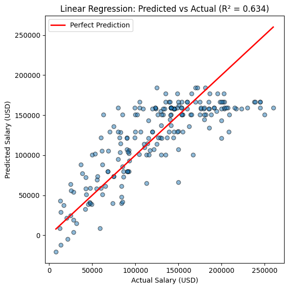


##### Feature Coefficent


```python
# ========================
# 7. Aggregate feature importances by original feature (LinearRegression)
# ========================

# Get coefficients from LinearRegression
linreg_coefs_3 = models_3["LinearRegression"].coef_

# Use same OHE feature names as before
ohe_3 = preprocessor_3.named_transformers_["cat"]
ohe_features_3 = ohe_3.get_feature_names_out(categorical_cols_3)
all_features_3 = list(ohe_features_3) + numeric_cols_3


# Map back to original columns
def map_to_original(feature_name):
    for col_3 in categorical_cols_3:
        if feature_name.startswith(col_3 + "_"):
            return col_3
    if feature_name in numeric_cols_3:
        return feature_name
    return feature_name


original_features_3 = [map_to_original(f_3) for f_3 in all_features_3]

# Aggregate absolute coefficients as importance
feature_importance_salaries_data_frame_3 = (
    pd.DataFrame({"feature": original_features_3, "importance": abs(linreg_coefs_3)})
    .groupby("feature")
    .sum()
    .sort_values(by="importance", ascending=False)
    .reset_index()
)

print("\n=== Aggregated Feature Importances (LinearRegression coefficients) ===")
print(feature_importance_salaries_data_frame_3)
```


    === Aggregated Feature Importances (LinearRegression coefficients) ===
                  feature     importance
    0  employee_residence  881968.462912
    1    company_location  820034.549297
    2    experience_level  118230.637728
    3           job_title   63336.200112
    4           work_year    5565.467702


```python
# ========================
# 8. Visualize aggregated feature importances
# ========================
plt.figure(figsize=(8, 5))
sns.barplot(x="importance", y="feature", data=feature_importance_salaries_data_frame_3)
plt.title("Aggregated Feature Importances (LinearRegression Coefficients)")
plt.xlabel("Importance (absolute coefficient)")
plt.ylabel("Feature")
plt.tight_layout()
plt.show()
```


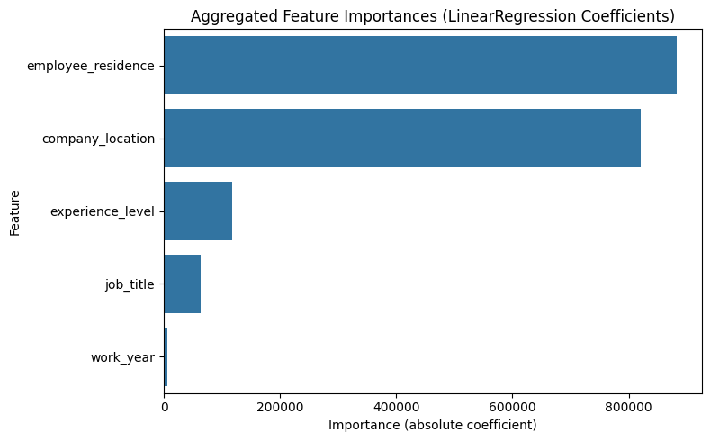


### Group Employees by Job Title, Experience Level, Employee Residence, Company Location


```python
import pandas as pd

# Group by multiple columns
grouped = (
    salaries_data_frame.groupby(
        ["job_title", "experience_level", "employee_residence", "company_location"]
    )["salary_in_usd"]
    .agg(count="count", mean_salary="mean", median_salary="median")
    .reset_index()
)

# Round salaries
grouped["mean_salary"] = grouped["mean_salary"].round(0)
grouped["median_salary"] = grouped["median_salary"].round(0)

# Add percentage column
total_count = grouped["count"].sum()
grouped["percentage"] = (grouped["count"] / total_count * 100).round(2)

# Remove rows with count = 0 (safety check)
grouped = grouped[grouped["count"] > 0]

# Sort by count (descending)
grouped = grouped.sort_values(by="count", ascending=False)

# Reorder columns
grouped = grouped[
    [
        "job_title",
        "experience_level",
        "employee_residence",
        "company_location",
        "count",
        "percentage",
        "mean_salary",
        "median_salary",
    ]
]

# Show result
print(grouped.to_string(index=False, line_width=10000))
```

                    job_title experience_level employee_residence company_location  count  percentage  mean_salary  median_salary
                Data Engineer               SE                 US               US    216       21.09     154309.0       150000.0
               Data Scientist               SE                 US               US    212       20.70     165500.0       160000.0
                 Data Analyst               SE                 US               US    114       11.13     121276.0       115467.0
    Machine Learning Engineer               SE                 US               US     52        5.08     177997.0       183000.0
                Data Engineer               MI                 US               US     35        3.42     117558.0       110000.0
                 Data Analyst               MI                 US               US     29        2.83     109606.0       110000.0
               Data Scientist               MI                 US               US     28        2.73     129219.0       130000.0
                Data Engineer               MI                 GB               GB     27        2.64      84430.0        82528.0
                Data Engineer               EN                 US               US     16        1.56      82625.0        82500.0
               Data Scientist               MI                 GB               GB     16        1.56      86411.0        78497.0
                 Data Analyst               EN                 US               US     15        1.46      74620.0        72000.0
                Data Engineer               EX                 US               US     13        1.27     206038.0       207000.0
               Data Scientist               EN                 US               US     11        1.07      89355.0        90000.0
               Data Scientist               SE                 CA               CA     10        0.98     169443.0       175500.0
                 Data Analyst               MI                 GB               GB      9        0.88      50965.0        49253.0
    Machine Learning Engineer               EN                 US               US      8        0.78     137635.0       131500.0
    Machine Learning Engineer               MI                 US               US      7        0.68     203479.0       193900.0
                 Data Analyst               SE                 CA               CA      7        0.68     109198.0       130000.0
                Data Engineer               MI                 GR               GR      6        0.59      70920.0        73546.0
                Data Engineer               SE                 GB               GB      6        0.59      88682.0        89281.0
                Data Engineer               MI                 ES               ES      6        0.59      70920.0        73546.0
               Data Scientist               SE                 ES               ES      6        0.59      43460.0        43460.0
                Data Engineer               EN                 IN               IN      5        0.49      19215.0        17022.0
               Data Scientist               MI                 IN               IN      5        0.49      26236.0        30523.0
               Data Scientist               MI                 DE               DE      5        0.49      82179.0        88654.0
               Data Scientist               EN                 FR               FR      4        0.39      44382.0        44781.0
               Data Scientist               EX                 US               US      4        0.39     197188.0       192500.0
               Data Scientist               EN                 IN               IN      4        0.39      24712.0        25646.0
               Data Scientist               MI                 NL               NL      4        0.39      83265.0        81426.0
                 Data Analyst               EN                 CA               CA      3        0.29      53221.0        52000.0
    Machine Learning Engineer               MI                 GB               GB      3        0.29     112461.0       116976.0
                 Data Analyst               MI                 GR               GR      3        0.29      31182.0        31520.0
    Machine Learning Engineer               EN                 GB               GB      3        0.29      40168.0        35093.0
                Data Engineer               EN                 GB               GB      3        0.29      45913.0        45390.0
               Data Scientist               MI                 ES               ES      3        0.29      41137.0        38776.0
                Data Engineer               SE                 PR               PR      2        0.20     167500.0       167500.0
               Data Scientist               MI                 CA               CA      2        0.20      71686.0        71686.0
                 Data Analyst               MI                 ES               ES      2        0.20      36773.0        36773.0
                 Data Analyst               MI                 CA               CA      2        0.20      80000.0        80000.0
                 Data Analyst               EX                 US               US      2        0.20     120000.0       120000.0
    Machine Learning Engineer               SE                 IN               IN      2        0.20      45304.0        45304.0
    Machine Learning Engineer               SE                 PR               PR      2        0.20     167500.0       167500.0
               Data Scientist               EN                 BE               BE      2        0.20      68030.0        68030.0
               Data Scientist               EN                 CA               CA      2        0.20      51417.0        51417.0
               Data Scientist               EN                 DE               DE      2        0.20      55997.0        55997.0
                 Data Analyst               EN                 FR               FR      2        0.20      43735.0        43735.0
                Data Engineer               SE                 CA               CA      2        0.20     161600.0       161600.0
                Data Engineer               MI                 TR               TR      2        0.20      20060.0        20060.0
                Data Engineer               MI                 DE               DE      2        0.20      62484.0        62484.0
                 Data Analyst               SE                 CF               CF      2        0.20      48609.0        48609.0
                 Data Analyst               SE                 GB               GB      2        0.20      73880.0        73880.0
                 Data Analyst               SE                 ES               ES      2        0.20      43602.0        43602.0
    Machine Learning Engineer               SE                 AE               AE      2        0.20      92500.0        92500.0
               Data Scientist               SE                 FR               FR      2        0.20      65438.0        65438.0
               Data Scientist               SE                 IE               IE      2        0.20     142500.0       142500.0
                Data Engineer               EN                 PK               DE      2        0.20      55108.0        55108.0
                Data Engineer               MI                 FR               FR      2        0.20      67640.0        67640.0
    Machine Learning Engineer               SE                 CA               CA      2        0.20     105000.0       105000.0
               Data Scientist               SE                 GB               GB      2        0.20     104663.0       104663.0
               Data Scientist               SE                 TR               TR      1        0.10      20171.0        20171.0
               Data Scientist               MI                 TR               TR      1        0.10      25000.0        25000.0
               Data Scientist               SE                 BR               US      1        0.10     100000.0       100000.0
    Machine Learning Engineer               EN                 CH               CH      1        0.10      56536.0        56536.0
               Data Scientist               SE                 ES               GB      1        0.10      88256.0        88256.0
               Data Scientist               SE                 GR               US      1        0.10      68428.0        68428.0
               Data Scientist               SE                 AT               AT      1        0.10      91237.0        91237.0
    Machine Learning Engineer               MI                 FR               DE      1        0.10      84053.0        84053.0
    Machine Learning Engineer               EN                 CO               CO      1        0.10      21844.0        21844.0
    Machine Learning Engineer               EN                 DE               DE      1        0.10      24823.0        24823.0
    Machine Learning Engineer               SE                 PT               US      1        0.10     150000.0       150000.0
    Machine Learning Engineer               SE                 NL               NL      1        0.10      59888.0        59888.0
    Machine Learning Engineer               SE                 IE               IE      1        0.10      68293.0        68293.0
    Machine Learning Engineer               SE                 HR               HR      1        0.10      45618.0        45618.0
    Machine Learning Engineer               SE                 FI               FI      1        0.10      63040.0        63040.0
    Machine Learning Engineer               SE                 DE               DE      1        0.10      94564.0        94564.0
    Machine Learning Engineer               SE                 BE               BE      1        0.10      82744.0        82744.0
    Machine Learning Engineer               MI                 SI               SI      1        0.10      24823.0        24823.0
    Machine Learning Engineer               MI                 PL               PL      1        0.10      46597.0        46597.0
    Machine Learning Engineer               MI                 NL               NL      1        0.10      96578.0        96578.0
    Machine Learning Engineer               MI                 JP               JP      1        0.10      74000.0        74000.0
    Machine Learning Engineer               MI                 IT               IT      1        0.10      51064.0        51064.0
    Machine Learning Engineer               MI                 IN               IN      1        0.10      20984.0        20984.0
               Data Scientist               MI                 RU               US      1        0.10      48000.0        48000.0
    Machine Learning Engineer               MI                 ES               ES      1        0.10      47282.0        47282.0
    Machine Learning Engineer               MI                 BE               BE      1        0.10      88654.0        88654.0
    Machine Learning Engineer               MI                 AU               AU      1        0.10      83864.0        83864.0
    Machine Learning Engineer               EN                 NL               DE      1        0.10      85000.0        85000.0
    Machine Learning Engineer               EN                 IN               IN      1        0.10      20000.0        20000.0
               Data Scientist               MI                 SG               IL      1        0.10     119059.0       119059.0
                 Data Analyst               EN                 AR               AR      1        0.10      50000.0        50000.0
               Data Scientist               MI                 RS               DE      1        0.10      25532.0        25532.0
                 Data Analyst               SE                 DE               DE      1        0.10      63831.0        63831.0
                Data Engineer               MI                 NL               NL      1        0.10      45391.0        45391.0
                Data Engineer               MI                 MT               MT      1        0.10      28369.0        28369.0
                Data Engineer               MI                 HK               GB      1        0.10      66022.0        66022.0
                Data Engineer               MI                 ES               US      1        0.10     130800.0       130800.0
                Data Engineer               MI                 AT               AT      1        0.10      74130.0        74130.0
                Data Engineer               EN                 NL               NL      1        0.10      59888.0        59888.0
                Data Engineer               EN                 JP               JP      1        0.10      41689.0        41689.0
                Data Engineer               EN                 DE               DE      1        0.10      65013.0        65013.0
                 Data Analyst               SE                 PH               PH      1        0.10      50000.0        50000.0
                 Data Analyst               SE                 BG               US      1        0.10      80000.0        80000.0
                Data Engineer               MI                 RO               US      1        0.10      26005.0        26005.0
                 Data Analyst               MI                 SG               SG      1        0.10      65257.0        65257.0
                 Data Analyst               MI                 PK               PK      1        0.10       8000.0         8000.0
                 Data Analyst               MI                 IN               IN      1        0.10       5723.0         5723.0
                 Data Analyst               MI                 FR               FR      1        0.10      46759.0        46759.0
                 Data Analyst               EN                 PT               PT      1        0.10      22809.0        22809.0
                 Data Analyst               EN                 NG               NG      1        0.10      10000.0        10000.0
                 Data Analyst               EN                 IN               IN      1        0.10       6072.0         6072.0
                 Data Analyst               EN                 ID               ID      1        0.10      15000.0        15000.0
                 Data Analyst               EN                 FR               IN      1        0.10       6359.0         6359.0
                Data Engineer               MI                 PL               PL      1        0.10      28476.0        28476.0
                Data Engineer               SE                 ES               US      1        0.10     193000.0       193000.0
               Data Scientist               MI                 PL               PL      1        0.10      33609.0        33609.0
               Data Scientist               MI                 CL               CL      1        0.10      40038.0        40038.0
               Data Scientist               MI                 PH               US      1        0.10      45760.0        45760.0
               Data Scientist               MI                 NG               NG      1        0.10      50000.0        50000.0
               Data Scientist               MI                 IN               US      1        0.10       5679.0         5679.0
               Data Scientist               MI                 IN               ID      1        0.10      53416.0        53416.0
               Data Scientist               MI                 HU               HU      1        0.10      35735.0        35735.0
               Data Scientist               MI                 HK               HK      1        0.10      65062.0        65062.0
               Data Scientist               MI                 FR               LU      1        0.10      62726.0        62726.0
               Data Scientist               MI                 FR               FR      1        0.10      42197.0        42197.0
               Data Scientist               MI                 DE               AT      1        0.10      61467.0        61467.0
               Data Scientist               MI                 CH               CH      1        0.10     120402.0       120402.0
                Data Engineer               SE                 GR               GR      1        0.10      47899.0        47899.0
               Data Scientist               MI                 BR               BR      1        0.10      12901.0        12901.0
                 Data Analyst               EN                 BR               BR      1        0.10       7799.0         7799.0
               Data Scientist               EN                 UA               UA      1        0.10      13400.0        13400.0
               Data Scientist               EN                 JP               MY      1        0.10      40000.0        40000.0
               Data Scientist               EN                 ES               ES      1        0.10      31520.0        31520.0
               Data Scientist               EN                 AU               AU      1        0.10      83171.0        83171.0
                Data Engineer               EX                 ES               ES      1        0.10      79833.0        79833.0
                Data Engineer               SE                 RO               GB      1        0.10      76833.0        76833.0
                Data Engineer               SE                 MX               MX      1        0.10      33511.0        33511.0
               Data Scientist               EN                 US               DE      1        0.10      50000.0        50000.0


    /var/folders/jh/z981c7zj0vz0gmyfc8mhdxdr0000gn/T/ipykernel_6856/3461952642.py:5: FutureWarning: The default of observed=False is deprecated and will be changed to True in a future version of pandas. Pass observed=False to retain current behavior or observed=True to adopt the future default and silence this warning.
      salaries_data_frame.groupby(


```python
# 1. Create new samples with STRING values and updated realistic salary fields
new_samples = pd.DataFrame(
    [
        {
            "work_year": 2023,
            "experience_level": "SE",
            "employment_type": "FT",
            "job_title": "Data Scientist",
            "employee_residence": "US",  ## United States
            "company_location": "US",  ## United States
            "company_size": "M",
            "remote_ratio": 100,
            "salary": 160000,
            "salary_currency": "USD",
            "salary_in_usd": 160000,
        },
        {
            "work_year": 2023,
            "experience_level": "MI",
            "employment_type": "FT",
            "job_title": "Data Engineer",
            "employee_residence": "GB",  ## United Kingdom
            "company_location": "GB",  ## United Kingdom
            "company_size": "L",
            "remote_ratio": 50,
            "salary": 82528.0,
            "salary_currency": "USD",
            "salary_in_usd": 82528.0,
        },
        {
            "work_year": 2023,
            "experience_level": "EN",
            "employment_type": "FT",
            "job_title": "Data Analyst",
            "employee_residence": "BR",  ## Brazil
            "company_location": "BR",  ## Brazil
            "company_size": "S",
            "remote_ratio": 0,
            "salary": 8000,
            "salary_currency": "USD",
            "salary_in_usd": 8000,
        },
    ]
)

# 2. Drop target columns (keep only features the model expects)
X_new = new_samples.drop(columns=["salary", "salary_currency", "salary_in_usd"])

# 3. Apply the SAME preprocessing pipeline you used for training
X_new_processed = preprocessor_3.transform(X_new)

# 4. Predict using the trained model
predictions = models_3["LinearRegression"].predict(X_new_processed)

# 5. Attach predictions back
new_samples["predicted_salary_usd"] = predictions.round(2)
import numpy as np

# 6. Compute error percentage
new_samples["error_percentage"] = (
    (new_samples["predicted_salary_usd"] - new_samples["salary_in_usd"])
    / new_samples["salary_in_usd"]
    * 100
).round(2)

# 7. Add comment about acceptability (e.g., <20% is okay in salary prediction)
new_samples["comment"] = np.where(
    new_samples["error_percentage"].abs() <= 20, "✅ Acceptable", "⚠️ High Error"
)

# 8. Print results clearly
print(new_samples.to_string(index=False, line_width=10000))
```

     work_year experience_level employment_type      job_title employee_residence company_location company_size  remote_ratio   salary salary_currency  salary_in_usd  predicted_salary_usd  error_percentage       comment
          2023               SE              FT Data Scientist                 US               US            M           100 160000.0             USD       160000.0             166271.88              3.92  ✅ Acceptable
          2023               MI              FT  Data Engineer                 GB               GB            L            50  82528.0             USD        82528.0              86858.68              5.25  ✅ Acceptable
          2023               EN              FT   Data Analyst                 BR               BR            S             0   8000.0             USD         8000.0             -13262.27           -265.78 ⚠️ High Error

